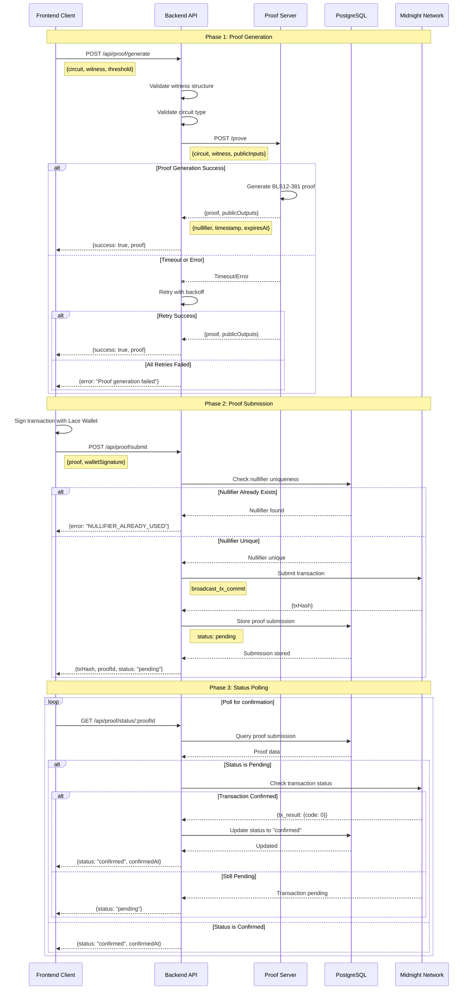
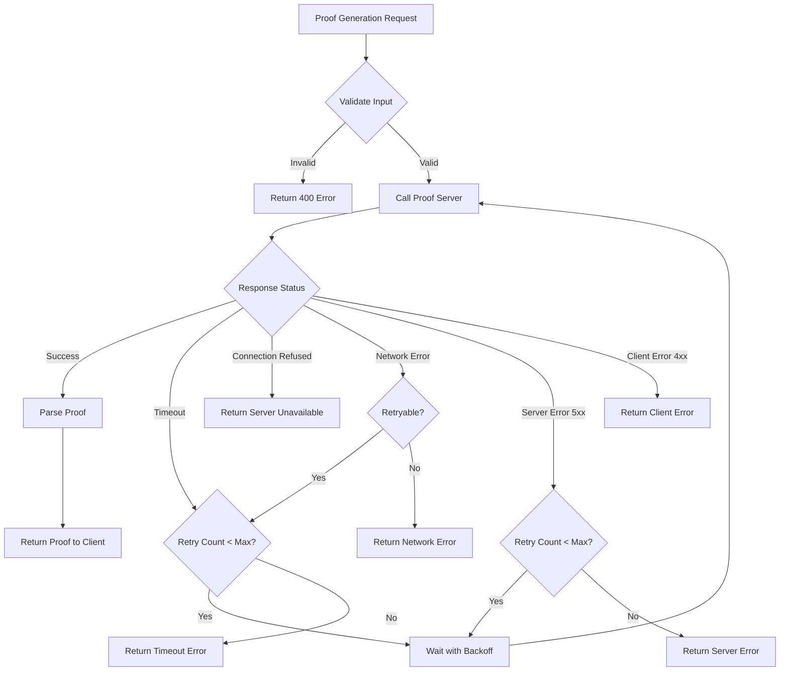
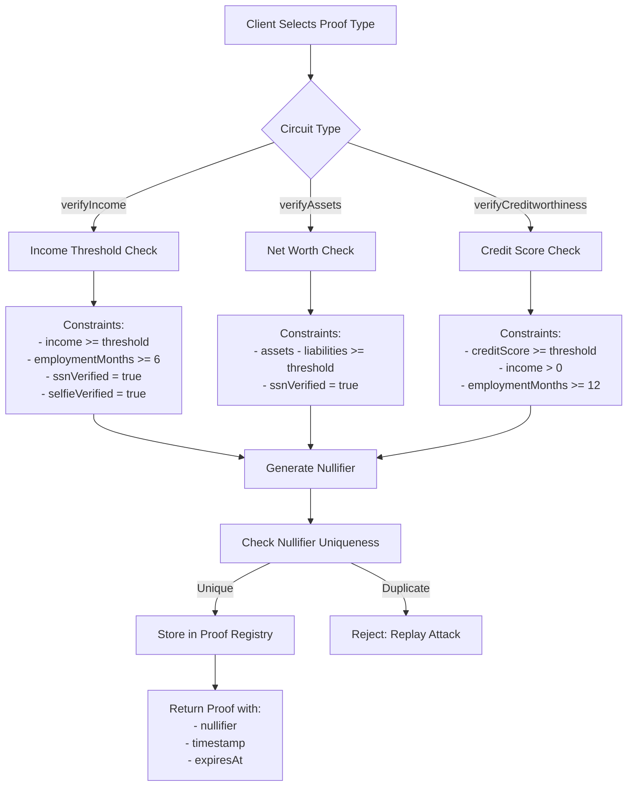
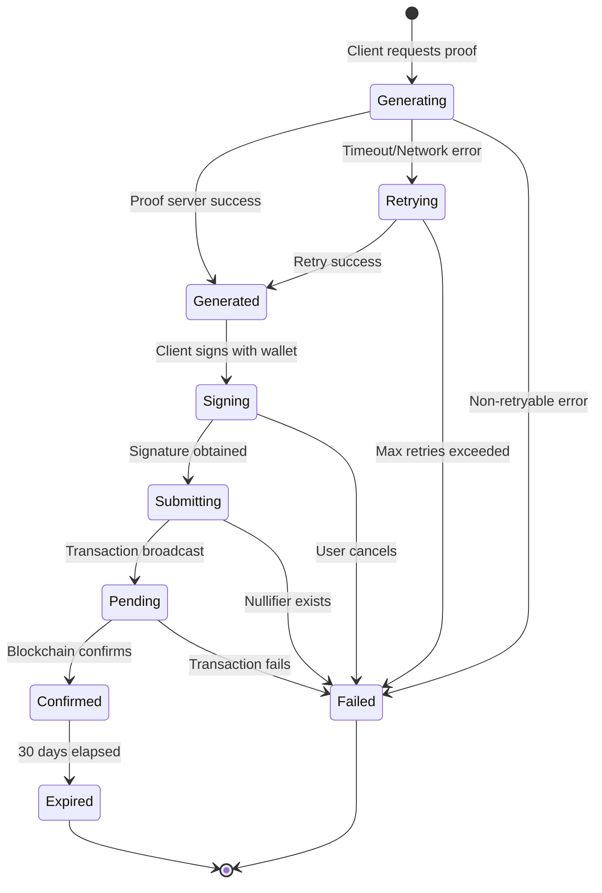

# Proof Server Flow Diagram

## Complete Proof Generation and Submission Flow



## Error Handling Flow



## Retry Logic Flow

```mermaid
flowchart TD
    A[Proof Generation Failed] --> B{Check Error Type}
    
    B -->|Timeout| C{Attempt < 3?}
    B -->|Network Error| C
    B -->|5xx Error| C
    B -->|Connection Refused| D[Don't Retry]
    B -->|4xx Error| D
    
    C -->|Yes| E[Calculate Backoff]
    E --> F[Delay = min(1000 * 2^attempt, 10000)]
    F --> G[Add Jitter ±30%]
    G --> H[Wait for Delay]
    H --> I[Retry Request]
    I --> J{Success?}
    
    J -->|Yes| K[Return Proof]
    J -->|No| C
    
    C -->|No| L[Return Final Error]
    D --> L
```

## Circuit Selection Flow



## Data Flow Architecture

```
┌─────────────────────────────────────────────────────────────┐
│                        Frontend Client                       │
│  ┌────────────┐  ┌────────────┐  ┌────────────┐            │
│  │   Plaid    │  │   Stripe   │  │    Lace    │            │
│  │   Link     │  │  Identity  │  │   Wallet   │            │
│  └─────┬──────┘  └─────┬──────┘  └─────┬──────┘            │
│        │               │               │                     │
│        └───────────────┴───────────────┘                     │
│                        │                                     │
│                  ┌─────▼──────┐                             │
│                  │  Witness   │                             │
│                  │ Constructor│                             │
│                  └─────┬──────┘                             │
│                        │                                     │
└────────────────────────┼─────────────────────────────────────┘
                         │ HTTPS
                         ▼
┌─────────────────────────────────────────────────────────────┐
│                      Backend API                             │
│  ┌──────────────────────────────────────────────────────┐  │
│  │              Proof Controller                         │  │
│  │  - generateProof()                                    │  │
│  │  - submitProof()                                      │  │
│  │  - getProofStatus()                                   │  │
│  └────────────┬─────────────────────────┬─────────────────┘  │
│               │                         │                    │
│  ┌────────────▼──────────┐  ┌──────────▼────────────┐      │
│  │  ProofServerService   │  │  MidnightService      │      │
│  │  - generateProof()    │  │  - submitTransaction()│      │
│  │  - healthCheck()      │  │  - getTransactionStatus()│   │
│  │  - retry logic        │  │  - queryProofRegistry()│      │
│  └────────────┬──────────┘  └──────────┬────────────┘      │
│               │                         │                    │
└───────────────┼─────────────────────────┼────────────────────┘
                │ HTTP                    │ JSON-RPC
                ▼                         ▼
┌──────────────────────┐    ┌──────────────────────────┐
│   Proof Server       │    │   Midnight Network       │
│   (Docker)           │    │                          │
│   Port 6300          │    │  ┌────────────────────┐  │
│                      │    │  │   JSON-RPC Node    │  │
│  ┌────────────────┐  │    │  │   Port 26657       │  │
│  │   Circuits     │  │    │  └────────────────────┘  │
│  │  - verifyIncome│  │    │                          │
│  │  - verifyAssets│  │    │  ┌────────────────────┐  │
│  │  - verifyCreditw│ │    │  │  Compact Contracts │  │
│  └────────────────┘  │    │  │  Proof Registry    │  │
└──────────────────────┘    │  └────────────────────┘  │
                            │                          │
                            │  ┌────────────────────┐  │
                            │  │  GraphQL Indexer   │  │
                            │  │  Port 8081         │  │
                            │  └────────────────────┘  │
                            └──────────────────────────┘
```

## State Transitions



## Performance Metrics

| Operation | Expected Time | Timeout |
|-----------|--------------|---------|
| Proof Generation | 2-5 seconds | 30 seconds |
| Transaction Submission | 1-2 seconds | 10 seconds |
| Status Check | < 500ms | 5 seconds |
| Health Check | < 100ms | 5 seconds |

## Error Codes

| Code | Description | Retryable |
|------|-------------|-----------|
| ECONNABORTED | Request timeout | Yes |
| ETIMEDOUT | Connection timeout | Yes |
| ECONNREFUSED | Server not running | No |
| ENETUNREACH | Network unreachable | Yes |
| 4xx | Client error | No |
| 5xx | Server error | Yes |
| NULLIFIER_ALREADY_USED | Replay attack | No |
